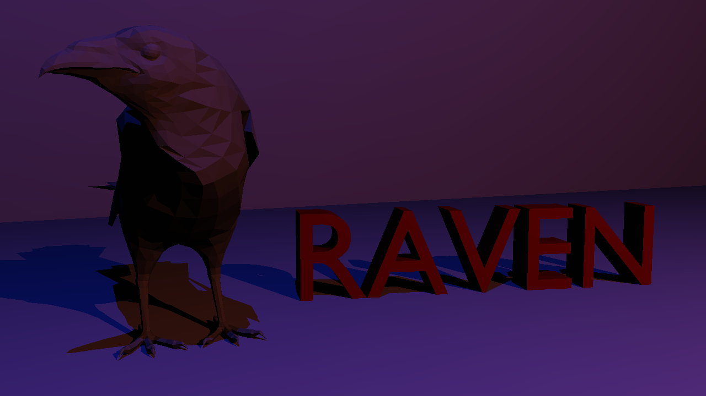
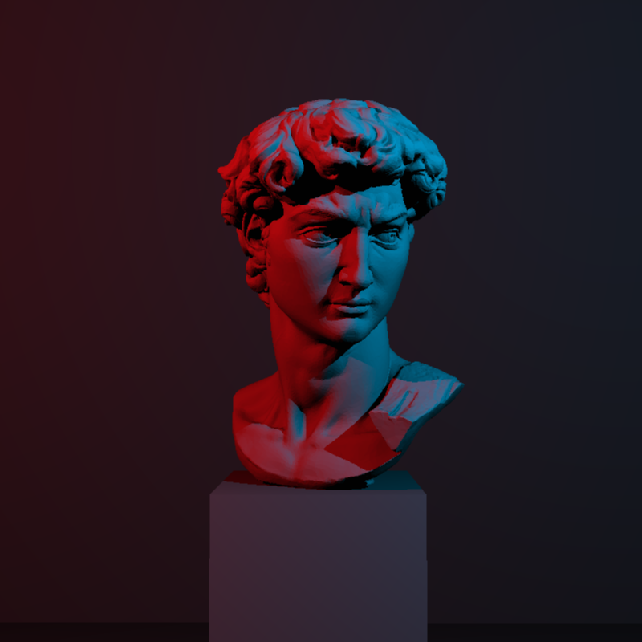
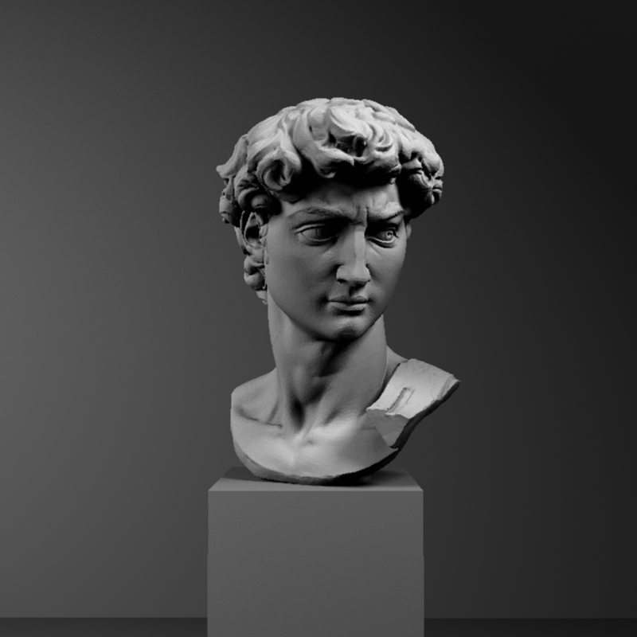
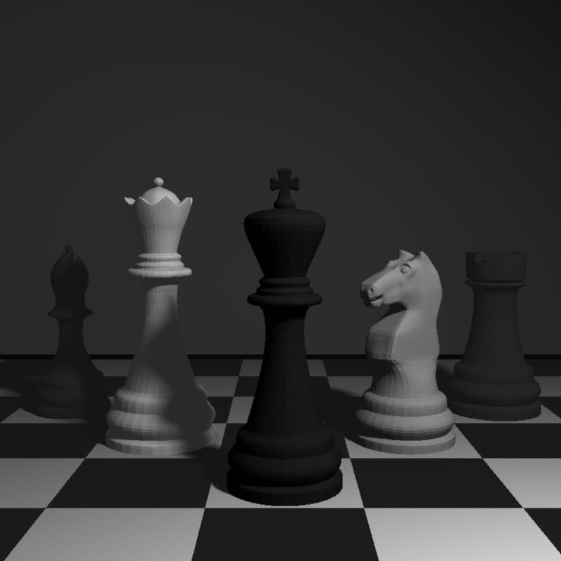
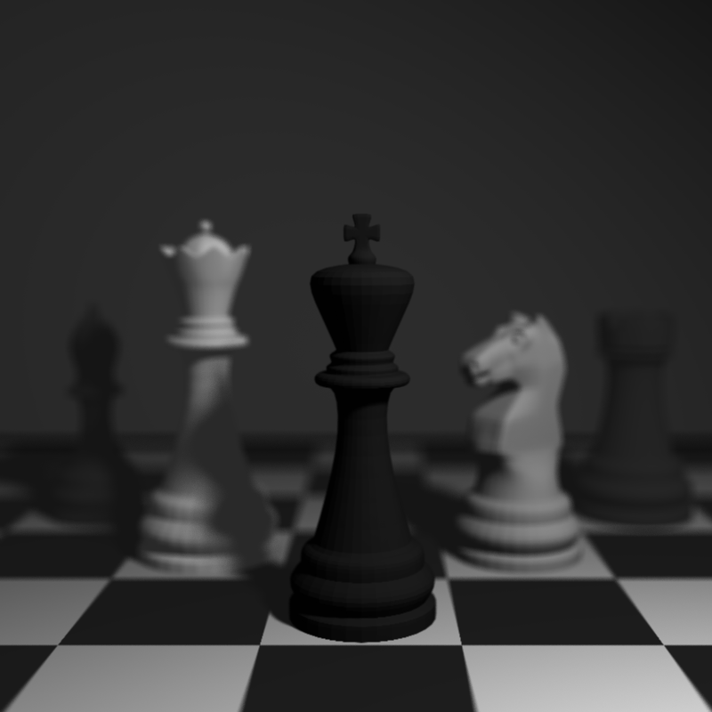
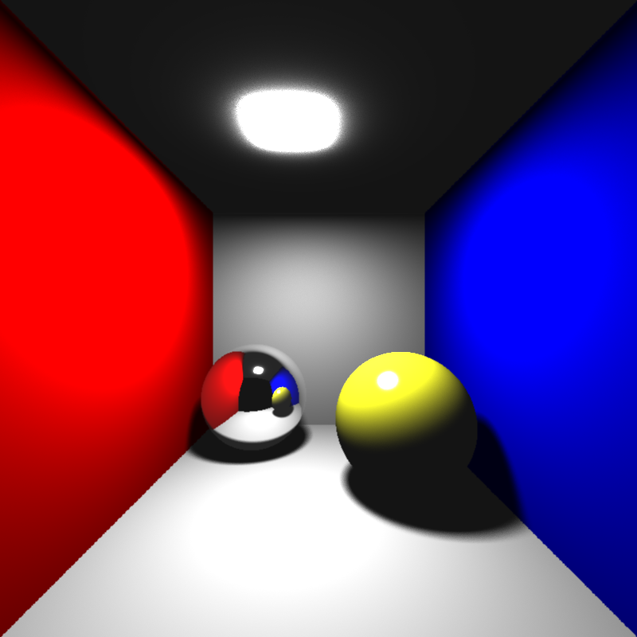
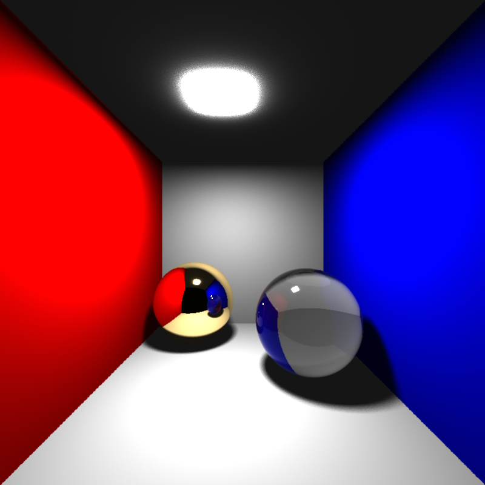
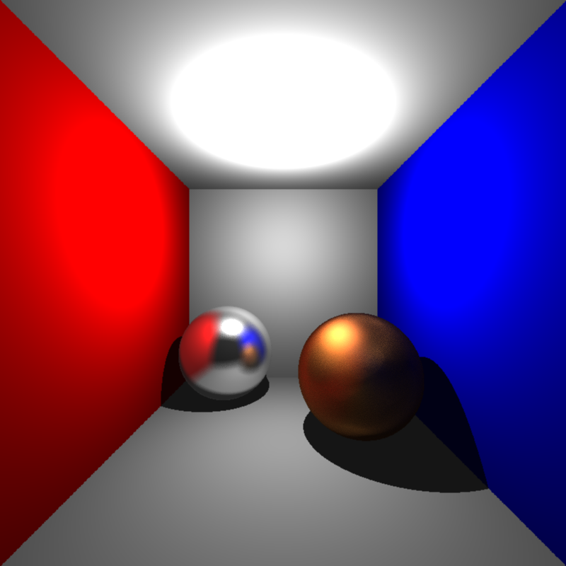

# Raven: Ray/Path Tracer



**Raven** is a ray/path tracer developed in modern C++ (C++20) as part of my **Advanced Ray Tracing** coursework. It supports a wide range of rendering features, including various intersection methods, realistic materials, advanced lighting, and texture techniques.

You can follow my journey and detailed progress on my [personal blog](https://ramazantokay.blogspot.com/2024/10/raven-beginning-of-my-ray-tracing.html), where I share insights, challenges, and results from each assignment.


## Features

### Intersections
- **Ray-Object Intersection**
  - Triangle Intersection
  - Sphere Intersection

### Acceleration Structures
- **Bounding Volume Hierarchy (BVH)**

### Transformations
- Object-level Transformation
- Instancing (efficient rendering of duplicate geometry)

### Rendering Techniques
- **Basic Ray Tracing**
- **Distribution Ray Tracing**
  - Depth of Field
  - Area Lights
  - Glossy Reflections
  - Motion Blur
- **Path Tracing**
  - Importance Sampling
  - Next Event Estimation
  - Russian Roulette

### Materials
- **Conductor (Metallic) Materials**
- **Dielectric (Transparent/Refractive) Materials**

### Lighting
- **Point Lights**
- **Directional Lights**
- **Spot Lights**
- **Environmental Lighting**
- **Object Lights**
  - Mesh-based
  - Sphere-based

### BRDF Models
- Phong
- Modified Phong
- Normalized Modified Phong
- Blinn-Phong
- Modified Blinn-Phong
- Normalized Modified Blinn-Phong
- Torrance-Sparrow

### Texture Mapping Techniques
- Standard Texture Mapping
- Normal Mapping
- Bump Mapping

### Image Output and Post-processing
- **Supported File Formats**
  - ppm
  - png
  - hdr
  - exr
- **High Dynamic Range (HDR) & Tone Mapping**
  - Reinhard Photographic Tone Mapping

### Scene Management
- **Scene Description:** XML-based scene description format, supporting meshes in XML and PLY file formats.

### Performance and Profiling
- **Multithreading** (Parallel rendering to utilize multiple CPU cores effectively)
- **Integrated Profiler:** Automatically generates profiling data (JSON format) for each rendered scene.

---

## Example Scenes

### David Scene with Point Light 100 ms



### David Scene with Area Light 400 ms



### Chess Scene with Area Light 900 ms






### Cornell Box with Area Light




### Cornell Box with Dielectric and Conductor Materials






## How to Use Raven

### Prerequisites
- **Compiler:** C++20 compatible compiler (e.g., MSVC, GCC, Clang)
- **Build System:** Premake
- **Supported Platforms:**
  - Windows 10
  - Linux

### Build Instructions

1. Clone the Repository:
```bash
git clone https://github.com/ramazantokay/raven.git
cd raven
```

2. Before building the project, you might need to add *executable permission* to the build script and premake executable.

```bash
chmod +x build.sh
chmod +x vendor/premake5
```

3. Run the build script. This will generate the project files for the selected build system.

For **Linux**
```bash
./build.sh gmake2
```
For **Windows**
```bash
./build.bat vs2022
```

4. Build the project.

* For **Linux**
```bash
 make config=release all
```

* For **Windows**, open the generated solution file and build the project.

5. Run the project.

* For **Linux**
```bash
./bin/Release-linux-x86_64/Nest/raytracer scene.xml
```

* For **Windows**, add the scene name as a command line argument in the project properties. Project properties -> Debugging -> Command Arguments.

```bash
scene.xml
```

Rendered images will be saved automatically in the output folder specified by the scene file configuration.

---

## TODO: Future Work

- Implement Smooth Shading 
- Refactor the codebase for better readability and maintainability

## License

This project is licensed under the [MIT License](LICENSE). You are free to modify, distribute, and use it according to the terms described.

---

## Disclaimer

Raven is provided "as is," without warranty of any kind. The author(s) assume no liability for any direct or indirect damages or losses arising from the use or inability to use this software.

---
